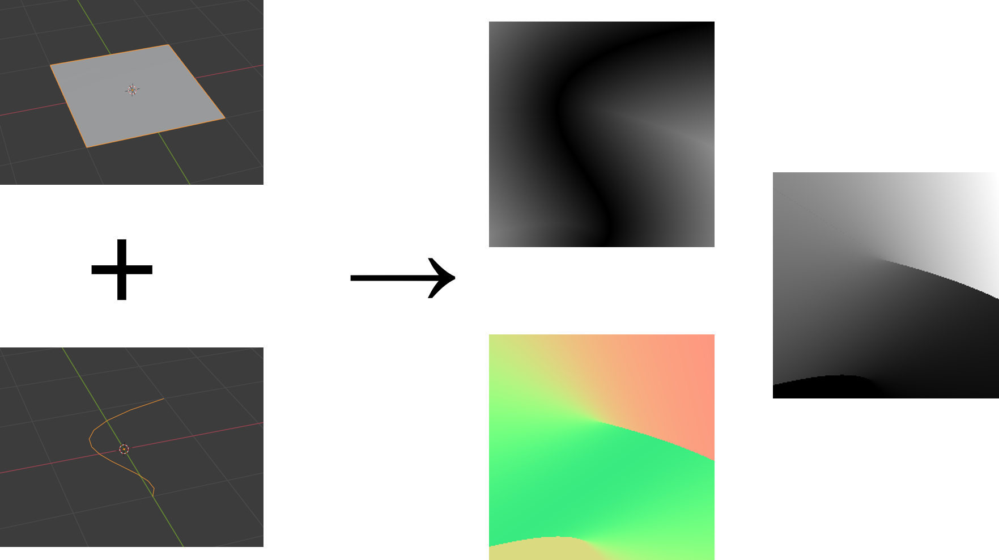
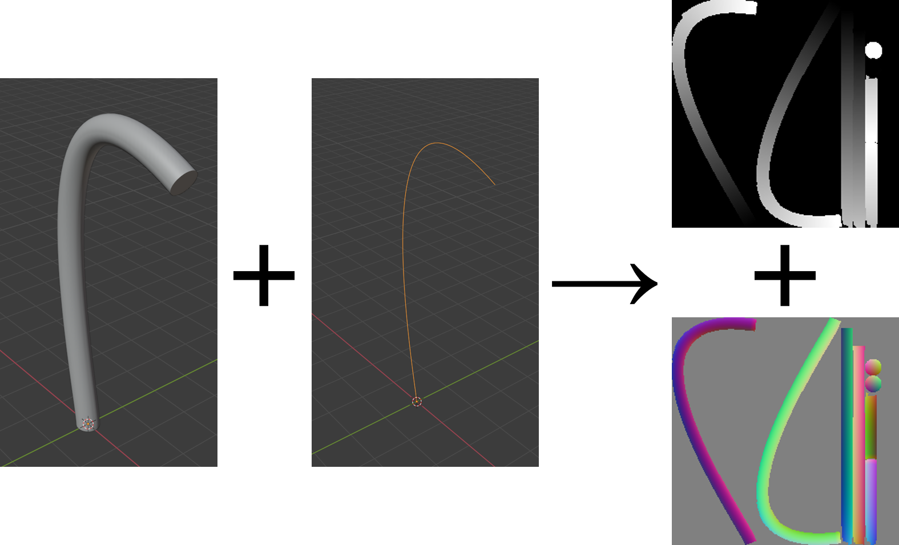
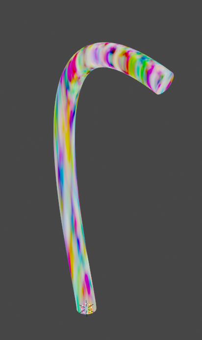
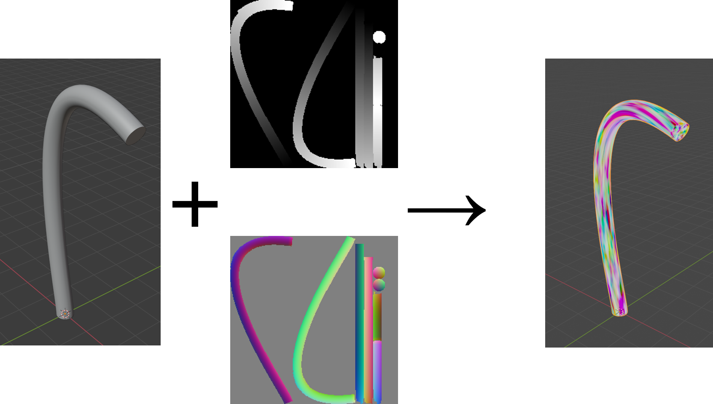

# vector-to-mesh-uv
A tool for generating non-color data for 3D models.

## Why?
When creating a 3D model, sometimes it is not possible to create a procedural material for it which is aligned to the geometry of the model. This program provides data in the form of image textures which can be accessed by the material. For example, one might have a cylindrical mesh which curves at the end. It would be very difficult to create a procedural material which similarly has a curve at the end, but with information on how 'far along' the mesh the point is, it becomes possible to do so. This program generates such information using a Bezier curve. 

## How it works
Data on the vertices and UV mapping of the mesh and Bezier curves is first dumped to a text file. The program reads these, takes every pixel on a 2D image, and detects whether each pixel is inside a UV triangle. If so, the program then uses [barycentric coordinates](https://en.wikipedia.org/wiki/Barycentric_coordinate_system "barycentric coordinates") to map each valid point from 2D space on the image to a 3D location in space. 

It then uses the method described in [Improved Algebraic Algorithm On Point Projection For Bézier Curves](https://hal.inria.fr/inria-00518379/document "Improved Algebraic Algorithm On Point Projection For Bézier Curves") to project each point in 3D space onto the nearest Bezier curve provided. Locating the nearest point on a Bezier curve requires finding the roots of the derivative of the distance function between the curve and the point. For the cubic splines Blender uses to describe curves, this ends up requiring solving a quintic equation, for which there is no algebraic formula. Instead, a Sturm chain is constructed to isolate intervals on which there exist exactly one root, and then a bisection algorithm is used to approximate the true value of the root. Each root found, along with the limits 0 and 1, are then tested to locate the closest point on the Bezier curve. Various data can then be generated, including the derivative of the Bezier curve, the distance to the Bezier curve, and the length of the curve from the start to the point in question. 

X-values, Y-values, and Z-values for the data are respectively stored in the R, G, and B channels of a 16-bit png image. In the case of the length generation, the main image stores the length while a secondary image stores the global coordinate offsets of the points on the mesh. 

## Usage
A WebAssembly version has been compiled and can be tested at [nkornelsen.github.io](https://nkornelsen.github.io "nkornelsen.github.io") along with some sample data. For faster computation using multithreading, a command line version exists. 

## Examples
### 2D Square and Curve

### Curved Mesh

#### Curved Mesh Without `vector-to-mesh-uv`

#### Curved Mesh With `vector-to-mesh-uv`

